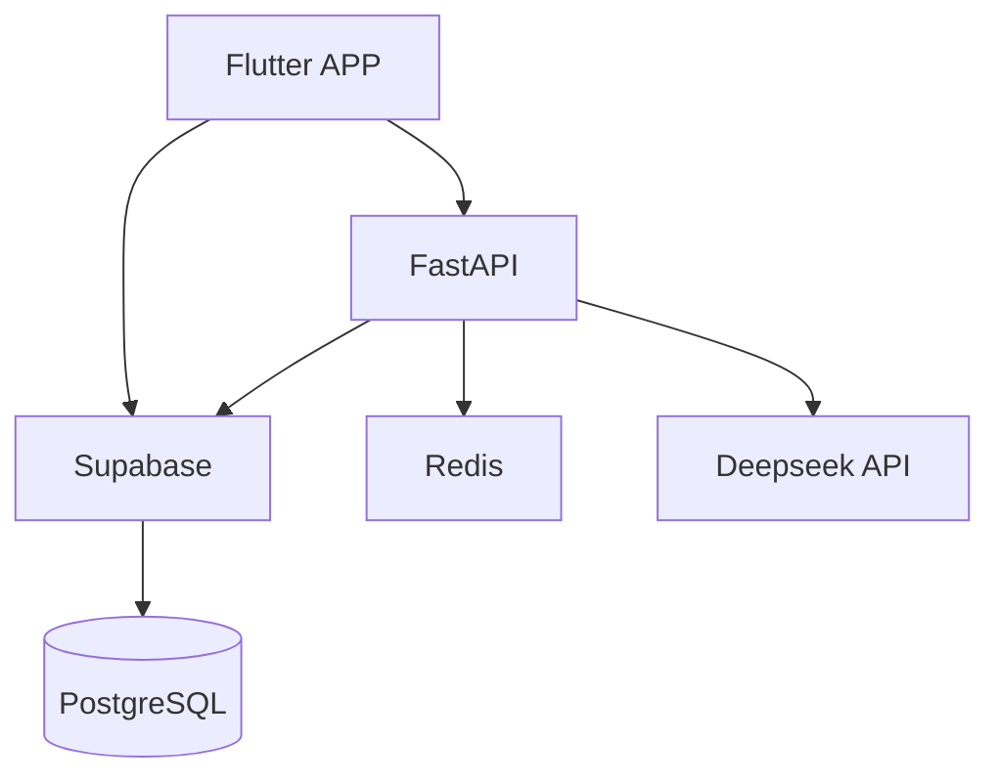

# AbyssPath - AI驱动的个性化学习路径生成器

## 项目概述
AbyssPath是一个基于AI的个性化学习路径生成系统，通过智能评估和路径规划，为用户提供定制化的学习体验。

## 技术栈
- 前端：Flutter 3.24.4
- 后端：FastAPI
- 数据库：Supabase/PostgreSQL
- 缓存：Redis
- AI模型：Deepseek API

## 系统架构
```
[Flutter App] <-> [FastAPI] <-> [Supabase] <-> [Redis] <-> [Deepseek API]
```

## 已完成功能
1. 用户认证系统
   - 注册/登录
   - 密码重置
   - 邮箱验证
   - 用户资料管理

2. 学习路径系统
   - 路径生成
   - 路径管理
   - 进度追踪
   - 学习资源管理

3. 能力评估系统
   - 多维度评估
   - 智能分析
   - 报告生成
   - 历史记录

4. 路由系统
   - 页面导航
   - 权限控制
   - 转场动画
   - 深层链接

## 项目结构
```
lib/
  ├── core/           # 核心功能
  │   ├── constants/  # 常量配置
  │   ├── error/      # 错误处理
  │   ├── services/   # 基础服务
  │   ├── theme/      # 主题配置
  │   ├── utils/      # 工具类
  │   └── widgets/    # 公共组件
  │
  ├── features/       # 功能模块
  │   ├── auth/       # 认证模块
  │   ├── path/       # 路径模块
  │   ├── assessment/ # 评估模块
  │   └── profile/    # 用户模块
  │
  ├── l10n/          # 国际化
  └── main.dart      # 入口文件
```

## 开发规范
1. 代码风格
   - 使用Dart官方代码风格
   - 遵循Clean Architecture架构
   - 使用BLoC模式进行状态管理
   - 实现适当的错误处理

2. 命名规范
   - 文件命名：小写字母，下划线分隔
   - 类命名：大驼峰
   - 变量命名：小驼峰
   - 常量命名：大写字母，下划线分隔

3. 注释规范
   - 文件注释：说明文件用途
   - 类注释：说明类功能
   - 方法注释：说明参数和返回值
   - 关键代码注释：说明实现逻辑

## 环境配置
1. Flutter环境
   - Flutter 3.24.4
   - Dart 3.3.0
   - Android Studio 火烈鸟
   - Android SDK 33/34/35

2. 后端环境
   - Python 3.11+
   - FastAPI
   - PostgreSQL 15+
   - Redis 7+

3. 依赖管理
   - pubspec.yaml：前端依赖
   - requirements.txt：后端依赖
   - package.json：工具依赖

## 开发流程
1. 功能开发
   - 创建功能分支
   - 实现功能代码
   - 编写单元测试
   - 提交代码审查

2. 测试流程
   - 单元测试
   - 集成测试
   - 性能测试
   - 用户测试

3. 部署流程
   - 代码审查
   - 自动化测试
   - 构建发布
   - 监控反馈

## 更新日志
### v1.0.0 (2024-04-12)
- 初始化项目结构
- 实现基础工具类
- 完成认证模块
- 搭建评估系统框架

## 贡献指南
1. Fork项目
2. 创建功能分支
3. 提交代码
4. 发起Pull Request

## 许可证
MIT License

## 项目概述
AbyssPath 是一个基于 AI 的个性化学习路径生成器，帮助用户根据个人特点和目标规划学习路径。

## 技术栈
- 前端：Flutter 3.24.4
- 后端：FastAPI + Supabase + PostgreSQL
- 缓存：Redis
- AI：Deepseek API (DeepSeek-V3)
- 状态管理：Riverpod
- 路由：GoRouter
- 网络请求：Dio
- 数据持久化：Supabase

## 系统架构


## 功能模块

### 已完成功能
1. 用户认证
   - 登录/注册
   - 密码重置
   - 会话管理

2. 学习路径
   - 路径列表展示
   - 路径详情页面
   - 基于 DeepSeek-V3 的智能路径生成
   - UUID 类型支持
   - 数据转换优化

3. 能力评估
   - 集成 Deepseek API
   - 评估问答界面
   - 能力雷达图展示
   - 评估结果分析

4. 路由系统
   - GoRouter 集成
   - 路由鉴权
   - 嵌套路由支持

### 后端服务
1. FastAPI服务
   - 路径管理API
     - 路径CRUD操作
     - 路径调整功能
     - 批量操作支持
   - 评估报告API
     - 报告生成
     - PDF导出
     - 历史记录
   - 用户画像API
     - 画像数据管理
     - 缓存优化
     - 实时更新

2. Redis缓存
   - 用户画像缓存
   - 路径数据缓存
   - 评估结果缓存
   - 会话管理

3. Supabase集成
   - 数据持久化
   - 实时订阅
   - 文件存储
   - 身份认证

### 待开发功能
1. 学习路径
   - [ ] 路径进度追踪
   - [ ] 学习资源推荐
   - [ ] 路径分享功能
   - [ ] 协作学习支持

2. 能力评估
   - [ ] 评估历史记录
   - [ ] 能力发展趋势
   - [ ] 个性化建议生成
   - [ ] 评估报告导出

3. 记录模块
   - [ ] 笔记系统
     - [ ] 学习笔记
     - [ ] 问题记录
     - [ ] 资源链接
     - [ ] 标签管理
   - [ ] 情绪记录
     - [ ] 日历打卡
     - [ ] 情绪分析
     - [ ] 学习关联

4. 社区功能
   - [ ] 用户互动
   - [ ] 经验分享
   - [ ] 学习小组
   - [ ] 导师系统

5. 系统优化
   - [ ] 离线支持
   - [ ] 性能优化
   - [ ] 数据备份
   - [ ] 多语言支持

## 环境配置
1. 前端环境变量（.env）：
   ```
   # Supabase配置
   SUPABASE_URL=your_supabase_url
   SUPABASE_ANON_KEY=your_supabase_key

   # Deepseek配置
   DEEPSEEK_API_KEY=your_api_key
   DEEPSEEK_BASE_URL=https://api.deepseek.com
   ```

2. 依赖安装：
   ```bash
   flutter pub get
   ```

3. 代码生成：
   ```bash
   dart run build_runner build --delete-conflicting-outputs
   ```

## 项目结构
```
lib/
  ├── core/           # 核心功能
  │   ├── config/     # 配置
  │   ├── constants/  # 常量
  │   ├── routes/     # 路由
  │   ├── services/   # 服务
  │   ├── theme/      # 主题
  │   ├── utils/      # 工具
  │   └── widgets/    # 通用组件
  │
  └── features/       # 功能模块
      ├── auth/       # 认证
      ├── assessment/ # 能力评估
      ├── record/     # 记录模块
      └── learning_path/ # 学习路径
```
## 开发规范
1. 代码风格：遵循 Flutter 官方推荐的代码风格
2. 提交规范：使用语义化的提交信息
3. 测试覆盖：确保核心功能有单元测试覆盖
4. 文档更新：功能变更时及时更新相关文档

## 项目结构

```
lib/
  ├── core/                 # 核心功能
  │   ├── constants/        # 常量配置
  │   ├── theme/           # 主题配置
  │   ├── utils/           # 工具类
  │   ├── widgets/         # 公共组件
  │   └── routes/          # 路由配置
  ├── features/            # 功能模块
  │   └── auth/            # 认证模块
  │       ├── data/        # 数据层
  │       ├── domain/      # 领域层
  │       └── presentation/# 表现层
  └── main.dart            # 入口文件

assets/                    # 资源文件
  ├── images/             # 图片资源
  ├── icons/              # 图标资源
  └── fonts/              # 字体资源
```

## 技术栈

- Flutter 3.24.4
- Riverpod (状态管理)
- GoRouter (路由管理)
- Dio + Retrofit (网络请求)
- GetIt + Injectable (依赖注入)
- Supabase (后端服务)

## 功能特性

- [ ] 用户认证
  - [ ] 登录
  - [ ] 注册
  - [ ] 密码重置
- [ ] 个人中心
  - [ ] 个人信息
  - [ ] 设置
- [ ] 主题切换
- [ ] 多语言支持

## 开发环境

- Flutter 3.24.4
- Dart SDK >=3.2.3 <4.0.0
- Android Studio Flamingo
- Android SDK 33/34/35
- JDK 17
- Gradle 8.3

## 运行项目

1. 克隆项目
```bash
git clone https://github.com/yourusername/abysspath01.git
```

2. 安装依赖
```bash
flutter pub get
```

   # 后端依赖
   cd backend
   pip install -r requirements.txt
   ```

## 开发指南
1. 前端开发
   - 使用Flutter 3.24.4
   - 遵循Material 3设计规范
   - 使用Riverpod进行状态管理
   - 使用GoRouter进行路由管理

2. 后端开发
   - 使用FastAPI框架
   - 遵循RESTful API设计规范
   - 使用Redis进行缓存优化
   - 使用Supabase进行数据存储

3. 数据库设计
   - 使用PostgreSQL作为主数据库
   - 使用Redis作为缓存数据库
   - 遵循数据库设计规范

4. 部署说明
   - 前端部署到Flutter Web
   - 后端部署到云服务器
   - Redis部署到云服务
   - Supabase使用云服务

## 贡献指南
1. Fork项目
2. 创建特性分支
3. 提交更改
4. 推送到分支
5. 创建Pull Request

## 许可证
MIT License

## 项目概述
AbyssPath是一个基于Flutter开发的多领域学习与能力评估平台，使用Supabase作为后端服务。该项目旨在通过AI辅助生成个性化学习路径，帮助用户系统地提升各领域能力。

### 核心功能

1.用户认证模块 (auth)
    "1.数据模型": {
        "User": "用户基本信息",
        "UserProfile": "用户详细资料",
        "AuthState": "认证状态管理"
    },
    "2.核心功能": {
        "注册": "邮箱注册流程",
        "登录": "多方式登录",
        "验证": "邮箱验证",
        "恢复": "密码重置"
    },
    "3.状态管理": "Riverpod状态控制",
    "4.UI组件": "登录表单等"

2.学习路径模块 (path)

- 深度分析用户画像（技能水平、学习风格、认知能力等）
- 多维度学习路径设计（技能、元能力、影响力）
- 个性化学习策略推荐
- 动态进度追踪和调整
- 支持多种学习资源类型（文章、视频、书籍、课程、工具）


​    "1.知识图谱": {
​        "节点管理": "概念/技能/项目",
​        "关系处理": "前置/进阶/引用",
​        "状态追踪": "完成度/掌握度"
​    },
​    "2.AI路径生成": {
​        "用户分析": "能力评估",
​        "路径规划": "DeepSeek接口",
​        "动态调整": "进度跟踪"
​    },
​    "3.资源管理": {
​        "类型": "文章/视频/书籍",
​        "存储": "Supabase存储",
​        "关联": "资源节点映射"
​    }

3.评估系统模块 (assessment)


    "1.数据结构": {
        "题库管理": "questions表",
        "评估记录": "assessment_records表",
        "能力指标": "meta_abilities表"
    },
    "2.评估流程": {
        "前置评估": "基础能力测试",
        "过程评估": "学习过程追踪",
        "阶段评估": "阶段性测试"
    },
    "3.分析系统": {
        "数据分析": "多维度分析",
        "报告生成": "评估报告",
        "建议系统": "改进建议"
    }

4.记录模块 (record)多类型记录支持

* 学习日志（学习内容、时长、难点）
* 思考记录（想法、灵感、总结）
* 情绪记录（学习状态、压力水平）
* 元能力评估（认知、执行、创新


    "1.记录类型": {
        "学习日志": "LearningLog",
        "思考记录": "Thought",
        "情绪记录": "MoodRecord"
    },
    "2.数据处理": {
        "存储逻辑": "PostgreSQL",
        "同步机制": "实时同步",
        "备份策略": "定期备份"
    },
    "3.分析功能": {
        "模式识别": "学习模式",
        "效率分析": "时间利用",
        "趋势追踪": "进步曲线"
    }

5.知识图谱系统

- 多类型知识节点管理（概念、技能、项目、里程碑、资源）
- 复杂知识关系建模（前置、进阶、引用关系）
- 增量更新与验证机制
- 循环依赖检测
- 节点状态追踪（未开始、进行中、已完成、已掌握）

### 项目结构

- 使用清晰的分层架构，遵循了特性模块化的组织方式

- 状态管理：Riverpod

  路由管理：GoRoute
  网络请求：Dio+Retrofit

  依赖注入：get_it+injectable
  建议：1.避免全局状态滥用，优先使用Providerhuoriverpod按需传递状态。2.路由配置规范化，使用AutoRoute或GoRoute。 3.测试驱动开发，结合flutter_test和mockito编写单元测试，确保状态逻辑的可靠性。

- 使用Supabase作为后端服务

- 使用DeepSeek AI服务进行学习路径生成和能力评估

  

## 核心功能详解

### 1. 学习路径生成
```dart
// 路径生成系统
class PathGenerator {
  // 核心配置
  final config = {
    'model': 'deepseek-coder-33b',  // AI模型
    'temp': 0.7,                    // 温度系数
    'maxTokens': 4096,              // 最大token数
  }
  
  // 提示词模板
  final prompts = {
    'pathGen': '''
      作为一个专业的学习路径规划专家，请基于以下用户信息生成个性化学习路径：
      背景：${profile.background}
      目标：${goal.description}
      时间：${timeframe}
      偏好：${preferences}
      
      请按照以下格式输出：
      1. 路径概述（整体规划和预期收益）
      2. 阶段划分（每个阶段的重点和时长）
      3. 具体任务（包含资源推荐和考核标准）
      4. 注意事项（潜在难点和应对策略）
      
      输出要求：
      - 符合SMART原则
      - 渐进式难度设计
      - 明确的里程碑节点
      - 可量化的评估标准
    ''',
    
    'pathAdjust': '''
      基于用户的学习反馈：${feedback}
      当前进度：${progress}
      遇到的困难：${difficulties}
      
      请对原有路径进行如下调整：
      1. 难度适配（根据实际表现调整）
      2. 进度优化（基于时间利用率）
      3. 资源补充（针对性建议）
      4. 激励机制（成就感设计）
    '''
  }
  
  // 路径维度定义
  final dimensions = {
    'skill': ['基础', '进阶', '专业'],
    'meta': ['认知', '执行', '创新'],
    'impact': ['个人', '团队', '社区']
  }
  
  // 资源类型
  final resourceTypes = {
    'theory': ['文章', '书籍', '视频课程'],
    'practice': ['项目', '练习', '工具'],
    'feedback': ['测试', '评估', '反馈']
  }
}
```

### 2. 能力评估系统
```dart
// 评估模型
class AssessmentSystem {
  // 评估维度
  final dimensions = {
    'cognitive': {
      'learning': ['理解力', '记忆力', '分析力'],
      'thinking': ['逻辑思维', '创造思维', '批判思维'],
      'meta': ['学习策略', '时间管理', '目标设定']
    },
    'execution': {
      'focus': ['注意力', '持续性', '抗干扰'],
      'efficiency': ['完成质量', '时间效率', '资源利用'],
      'adaptation': ['问题解决', '压力应对', '变化适应']
    },
    'innovation': {
      'creativity': ['发散思维', '联想能力', '创新意识'],
      'implementation': ['方案设计', '资源整合', '实践能力'],
      'impact': ['价值创造', '影响力', '持续改进']
    }
  }
  
  // 评估方法
  final methods = {
    'objective': {
      'quiz': '客观题测试',
      'task': '实践任务评估',
      'project': '项目完成度'
    },
    'subjective': {
      'self': '自我评估',
      'peer': '同伴评价',
      'expert': '专家评定'
    },
    'data': {
      'behavior': '行为数据分析',
      'performance': '表现指标统计',
      'progress': '进度追踪分析'
    }
  }
  
  // 评估提示词
  final prompts = {
    'skillAssess': '''
      基于用户的以下表现数据：
      - 学习行为：${behavior}
      - 完成情况：${completion}
      - 测试结果：${testResults}
      
      请从以下维度进行能力评估：
      1. 技能掌握度（分项打分和详细说明）
      2. 学习效率（时间投入与产出分析）
      3. 问题分析（当前瓶颈和改进建议）
      4. 发展建议（下一步提升方向）
    ''',
    
    'metaAssess': '''
      请分析用户的元能力表现：
      认知数据：${cognitiveData}
      执行数据：${executionData}
      创新数据：${innovationData}
      
      输出要求：
      1. 能力雷达图数据
      2. 优势劣势分析
      3. 改进策略建议
      4. 长期发展规划
    '''
  }
  
  // 评估标准
  final standards = {
    'level': {
      1: '入门',
      2: '基础',
      3: '进阶',
      4: '专业',
      5: '专家'
    },
    'criteria': {
      'mastery': '知识/技能掌握程度',
      'application': '实践应用能力',
      'innovation': '创新突破表现',
      'influence': '影响力辐射范围'
    }
  }
}
```

### 3. 知识图谱
```dart
// 节点类型
- 概念（Concept）
- 技能（Skill）
- 项目（Project）
- 里程碑（Milestone）
- 资源（Resource）

// 边类型
- 前置关系（Prerequisite）
- 进阶关系（Progression）
- 引用关系（Reference）
```

### 4. 数据结构
```dart
// 核心表
- knowledge_points（知识点）
- knowledge_relations（知识关系）
- learning_resources（学习资源）
- knowledge_resources（知识-资源关联）

// 辅助表
- user_progress（用户进度）
- learning_paths（学习路径）
- assessment_records（评估记录）
```

### 5. 学习记录
```dart
// 记录类型
- LearningLog（学习日志）
  * content: String       // 学习内容
  * duration: Duration    // 学习时长
  * difficulty: double    // 难度评级
  * tags: List<String>   // 标签列表
  * resources: List<Resource> // 关联资源

- Thought（思考记录）
  * content: String      // 思考内容
  * category: String     // 分类
  * relatedTopics: List<String> // 相关主题
  * inspiration: String  // 灵感来源

- MoodRecord（情绪记录）
  * level: double       // 情绪水平
  * energy: double      // 能量水平
  * focus: double       // 专注度
  * notes: String       // 备注说明

- MetaAbility（元能力记录）
  * cognitive: double   // 认知能力
  * execution: double   // 执行能力
  * innovation: double  // 创新能力
  * metrics: Map<String, double> // 详细指标

// 分析维度
- 时间维度（日、周、月、季、年）
- 主题维度（知识点、技能、项目）
- 效率维度（投入产出、难度分布）
- 情绪维度（状态波动、压力水平）
- 能力维度（进步轨迹、瓶颈分析）
```

### 1. DeepSeek接口配置
```dart
// DeepSeek配置类
class DeepSeekConfig {
  // API配置
  final apiConfig = {
    'baseUrl': 'https://api.deepseek.com/v1',  // API基础地址
    'version': 'v1',                           // API版本
    'model': 'deepseek-coder-33b-instruct',   // 默认模型
    'timeout': Duration(seconds: 30),          // 超时时间
  }
  
  // 密钥管理（使用环境变量）
  final secretConfig = {
    'apiKey': '\${DEEPSEEK_API_KEY}',         // API密钥
    'orgId': '\${DEEPSEEK_ORG_ID}',           // 组织ID
  }
  
  // 请求配置
  final requestConfig = {
    'temperature': 0.7,        // 温度系数
    'maxTokens': 4096,         // 最大token数
    'topP': 0.95,             // 采样阈值
    'topK': 50,               // 采样数量
    'repetitionPenalty': 1.1,  // 重复惩罚
    'stopTokens': ['<|end|>'], // 停止标记
  }
  
  // 错误重试
  final retryConfig = {
    'maxRetries': 3,           // 最大重试次数
    'retryDelay': 1000,        // 重试延迟(ms)
    'retryStatusCodes': [      // 需要重试的状态码
      429,  // 限流
      500,  // 服务器错误
      502,  // 网关错误
      503,  // 服务不可用
      504   // 网关超时
    ]
  }
}


// 环境变量配置（.env文件）
'''
# DeepSeek API配置
DEEPSEEK_API_KEY=sk-xxxxx    # API密钥
DEEPSEEK_ORG_ID=org-xxxxx    # 组织ID

# 环境配置
DEEPSEEK_ENV=production      # 环境(development/production)
DEEPSEEK_DEBUG=false         # 调试模式
DEEPSEEK_TIMEOUT=30000       # 超时时间(ms)

# 代理配置（可选）
DEEPSEEK_PROXY_HOST=        # 代理服务器
DEEPSEEK_PROXY_PORT=        # 代理端口
DEEPSEEK_PROXY_USERNAME=    # 代理用户名
DEEPSEEK_PROXY_PASSWORD=    # 代理密码
'''
```

## 开发规范

### 开发流程
1. 功能规划和设计
2. 数据结构定义
3. 服务层实现
4. 控制器开发
5. UI实现
6. 测试和优化


## 技术栈
- Flutter: UI框架
- Riverpod: 状态管理
- Supabase: 后端服务
- PostgreSQL: 数据库
- WebP: 图像优化

## 环境配置

安装依赖

```bash
flutter pub get
```

配置Supabase

- 在Supabase控制台创建新项目
- 复制项目URL和匿名密钥
- 更新`lib/core/constants/app_constants.dart`中的配置：
```dart
static const supabaseUrl = 'YOUR_SUPABASE_PROJECT_URL';
static const supabaseAnonKey = 'YOUR_SUPABASE_ANON_KEY';
```

4. 运行数据库迁移
```bash
cd supabase
supabase db reset
```

## 项目结构


## 数据库结构

### 主要表
1. users - 用户表
2. questionnaires - 问卷表
3. questions - 题目表
4. assessment_records - 评估记录表
5. interests - 兴趣表
6. user_interests - 用户兴趣关联表
7. learning_logs - 学习日志表
8. thoughts - 思考记录表
9. mood_records - 情绪记录表
10. meta_abilities - 元能力记录表

### 存储桶
- avatars: 用户头像
- images: 通用图片
- documents: 文档文件

## 错误处理
项目使用多层错误处理机制：
1. 网络层错误处理
2. 业务层错误处理
3. UI层错误展示
4. 错误日志记录

## 图像处理
- 自动压缩和格式转换
- WebP格式优化
- 服务器端处理
- 渐进式加载

## 安全特性
- 行级安全策略(RLS)
- 用户认证
- 数据加密
- 访问控制

### API密钥管理
- 使用环境变量存储敏感信息
- 支持密钥轮换机制
- 访问权限控制
- 使用代理服务器
- 请求频率限制

## DeepSeek API 集成说明

### 1. API 配置
```env
# DeepSeek配置（使用最新的 DeepSeek-V3）
DEEPSEEK_API_KEY=your_api_key
DEEPSEEK_BASE_URL=https://api.deepseek.com
```

### 2. 功能特性
- 使用最新的 DeepSeek-V3 模型
- 支持结构化 JSON 输出
- 智能提示词优化
- 完善的错误处理机制

### 3. 路径生成示例
```json
{
  "title": "学习路径标题",
  "description": "路径描述",
  "targetSkills": ["技能1", "技能2"],
  "estimatedDuration": 90,
  "difficulty": "beginner/intermediate/advanced",
  "stages": [
    {
      "title": "阶段标题",
      "description": "阶段描述",
      "order": 1,
      "duration": 30,
      "prerequisites": "前置要求",
      "tasks": [
        {
          "title": "任务标题",
          "description": "任务描述",
          "type": "learning/practice/quiz",
          "order": 1,
          "deadline": "2024-12-31T00:00:00Z",
          "progress": 0
        }
      ]
    }
  ]
}
```

### 4. 错误处理
- API 调用错误（404、401、429 等）
- JSON 格式验证
- 响应内容验证
- 详细的错误提示

### 5. 性能优化
- 单例 Dio 实例
- 请求缓存
- 错误重试机制
- 响应数据验证

## Git分支管理规范

### 分支结构
```
main/          # 主分支，用于存放稳定的生产版本
├── develop/   # 开发分支，所有功能开发都基于此分支
│   ├── feature/  # 功能分支
│   ├── hotfix/   # 紧急修复分支
│   └── release/  # 发布分支
```

### 分支命名规范

#### 功能分支 (feature)
- 格式：`feature/模块名-功能名`
- 示例：`feature/auth-login`
- 说明：用于开发新功能，从develop分支创建，完成后合并回develop分支

#### 修复分支 (hotfix)
- 格式：`hotfix/问题描述`
- 示例：`hotfix/fix-login-error`
- 说明：用于修复生产环境中的紧急问题，从main分支创建，完成后同时合并到main和develop分支

#### 发布分支 (release)
- 格式：`release/版本号`
- 示例：`release/v2.0.0`
- 说明：用于版本发布，从develop分支创建，完成后同时合并到main和develop分支

### 工作流程
1. 功能开发：从develop分支创建feature分支
2. 问题修复：从main分支创建hotfix分支
3. 版本发布：从develop分支创建release分支
4. 合并规则：
   - feature分支 -> develop分支
   - hotfix分支 -> main分支 + develop分支
   - release分支 -> main分支 + develop分支


